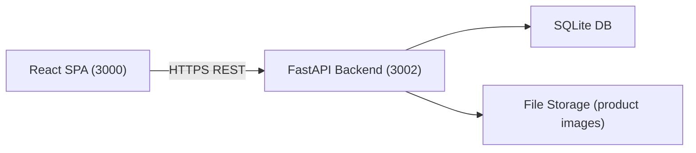

# Migration Architecture: HLD and Modules

## High-Level Architecture
- React SPA (modern-application-migration-301961) consumes REST APIs from FastAPI backend (modern-application-migration-301960). 
- FastAPI persists data to SQLite (single file database). Media files stored on disk with secure upload endpoints.
- CORS enabled for SPA origin. Authentication via JWT; role checks for admin endpoints.

## API Surface Outline
- Auth:
  - POST /auth/register
  - POST /auth/login
  - POST /auth/logout
  - GET /auth/me
- Users/Admins:
  - GET /users (admin)
  - GET /admins (super-admin) / POST /admins (admin)
- Products:
  - GET /products
  - GET /products/{id}
  - GET /products/search?q=
  - POST /products (admin)
  - PUT /products/{id} (admin)
  - DELETE /products/{id} (admin)
  - POST /products/{id}/images (admin)
- Wishlist:
  - GET /wishlist
  - POST /wishlist {pid}
  - DELETE /wishlist/{id}
  - DELETE /wishlist (clear all)
- Cart:
  - GET /cart
  - POST /cart {pid, qty}
  - PATCH /cart/{id} {qty}
  - DELETE /cart/{id}
  - DELETE /cart (clear all)
- Orders:
  - GET /orders (mine)
  - POST /orders (checkout)
  - GET /admin/orders (admin)
  - PATCH /admin/orders/{id}/status {payment_status} (admin)
- Messages:
  - POST /messages
  - GET /admin/messages (admin)
  - DELETE /admin/messages/{id} (admin)
- Dashboard (admin):
  - GET /admin/metrics (pendings, completes, counts)

## Data Model Mapping PHP → FastAPI/SQLite
- users: id, name, email UNIQUE, password_hash, created_at.
- admins: id, name, password_hash, role (admin/superadmin).
- products: id, name, details, price (integer cents or decimal), image_01, image_02, image_03.
- wishlist: id, user_id, pid, added_at.
- cart: id, user_id, pid, quantity, created_at.
- orders: 
  - Replace total_products string with normalized order_items table:
  - orders: id, user_id, name, number, email, method, address, total_price, placed_on, payment_status.
  - order_items: id, order_id, pid, name, price, quantity.
- messages: id, user_id (nullable), name, email, number, message, created_at.

## React SPA State and Routing
- Routing:
  - / (Home), /shop, /search, /product/:id, /cart, /wishlist, /checkout, /orders, /about, /contact, /login, /register
  - /admin: /admin/login, /admin/products, /admin/orders, /admin/users, /admin/admins, /admin/messages, /admin/dashboard
- State:
  - Auth context stores tokens and user info.
  - Data fetching via fetch/axios or React Query.
  - Cart and wishlist synchronized with backend endpoints.
- UI Libraries:
  - Swiper-like carousel via react-slick or Swiper React.
  - Icons via Font Awesome React package.

Sources:
- E-commerce-PHP-Application-301945 shop_db.sql and PHP flows
- modern-application-migration-301960/backend_api/src/api/main.py, interfaces/openapi.json
- modern-application-migration-301961/frontend_app/src/App.js
